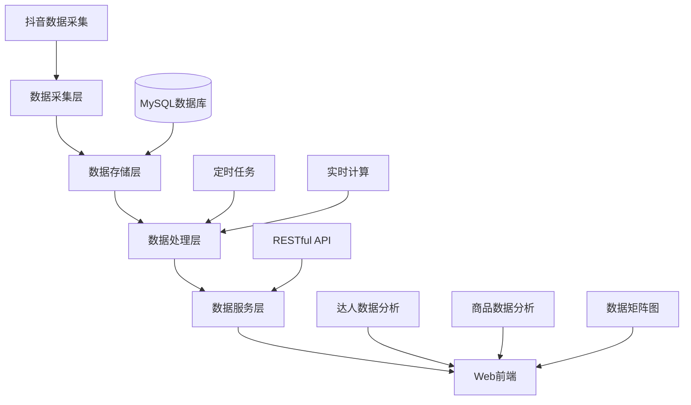

# MediaOp 数据分析系统架构设计

## 1. 系统概述

MediaOp 是一个面向短视频带货账号运营的数据分析系统，旨在帮助运营人员快速识别热门商品和优秀达人，从而优化内容策略。

## 2. 系统架构

### 2.1 整体架构图



### 2.2 技术栈

- 后端：Python + FastAPI
- 数据库：MySQL
- 前端：React + Ant Design (支持响应式设计)
- 任务调度：Celery + Redis
- 部署：Docker + Docker Compose

## 3. 数据模型扩展

### 3.1 预计算数据表

为了提高查询性能，需要新增以下预计算表：

#### 商品达人统计表 (product_creator_stats)
```
- id: 主键
- product_id: 商品ID
- user_id: 达人ID
- nickname: 达人昵称
- category: 一级分类
- category2: 二级分类
- period_days: 统计周期(3/5/7/30)
- video_count: 视频数量
- avg_digg_count: 平均点赞数
- avg_collect_count: 平均收藏数
- avg_share_count: 平均转发数
- total_digg_count: 总点赞数
- total_collect_count: 总收藏数
- total_share_count: 总转发数
- first_post_date: 首次发布时间
- last_post_date: 最后发布时间
- updated_at: 更新时间
```

#### 商品矩阵数据表 (product_matrix_stats)
```
- id: 主键
- product_id: 商品ID
- product_title: 商品标题
- category: 一级分类
- category2: 二级分类
- period_days: 统计周期(3/5/7/30)
- video_count: 视频数量
- total_digg_count: 总点赞数
- total_collect_count: 总收藏数
- total_share_count: 总转发数
- avg_digg_count: 平均点赞数
- avg_collect_count: 平均收藏数
- avg_share_count: 平均转发数
- updated_at: 更新时间
```

## 4. 核心功能模块

### 4.1 数据处理模块

#### 4.1.1 视频增量计算任务
- **执行频率**：每小时执行一次
- **处理逻辑**：
  1. 获取前一天所有视频的每日增量数据
  2. 对于新发布的视频，使用总量数据
  3. 对于只有一天数据的历史视频，跳过处理

#### 4.1.2 统计数据预计算任务
- **执行频率**：每天凌晨2点执行
- **处理逻辑**：
  1. 计算各时间周期(3/5/7/30天)内的商品达人统计数据
  2. 计算各时间周期内的商品矩阵数据
  3. 更新预计算表数据

### 4.2 API服务模块

#### 4.2.1 达人商品分析接口
- `GET /api/creators/{user_id}/products`
- 参数：
  - period_days: 统计周期(3/5/7/30)
  - sort_by: 排序字段(digg/collect/share)
  - category: 一级分类(可选)
- 返回：达人拍摄商品按品类统计数据

#### 4.2.2 商品视频分析接口
- `GET /api/products/{product_id}/videos`
- 参数：
  - period_days: 统计周期(3/5/7/30)
  - sort_by: 排序字段(digg/collect/share)
- 返回：商品相关视频数据排行

#### 4.2.3 数据矩阵图接口
- `GET /api/products/matrix`
- 参数：
  - period_days: 统计周期(3/5/7/30)
  - metric: 指标字段(digg/collect/share)
- 返回：商品矩阵图数据

### 4.3 前端展示模块

#### 4.3.1 达人商品分析页面
- 达人选择器
- 时间周期选择器(3/5/7/30天)
- 排序字段选择器
- 一级分类筛选器
- 商品品类数据表格展示（支持移动端响应式）

#### 4.3.2 商品视频分析页面
- 商品搜索功能
- 时间周期选择器
- 排序字段选择器
- 视频数据排行榜展示（支持移动端响应式）

#### 4.3.3 数据矩阵图页面
- 时间周期选择器
- 指标字段选择器
- 矩阵图可视化展示（支持移动端响应式）
- 商品详情查看功能

## 5. 实施计划

### 5.1 第一阶段：数据模型和处理逻辑
1. 创建预计算数据表
2. 实现视频增量计算任务
3. 实现统计数据预计算任务

### 5.2 第二阶段：API服务
1. 实现达人商品分析接口
2. 实现商品视频分析接口
3. 实现数据矩阵图接口

### 5.3 第三阶段：前端界面
1. 开发达人商品分析页面
2. 开发商品视频分析页面
3. 开发数据矩阵图页面
4. 实现响应式设计适配移动端